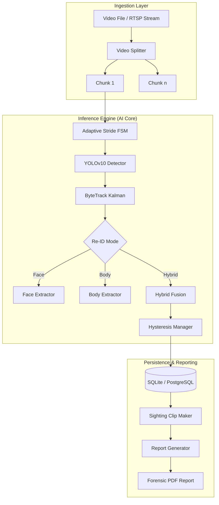
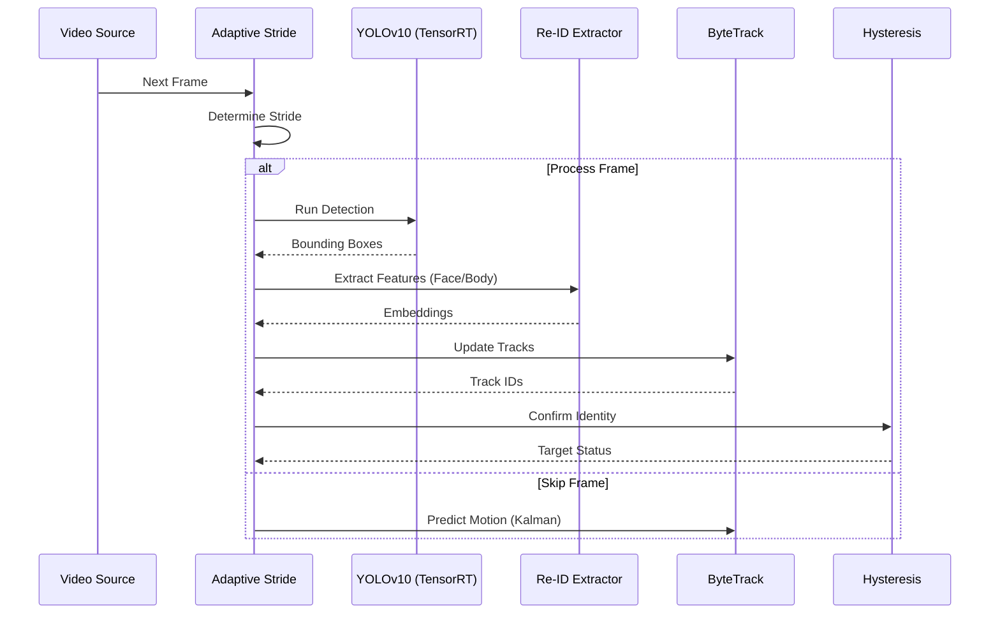

# Forensic Identity & Person Tracking System

## Technical Architecture Documentation

### 1. Executive Summary
The **Forensic Identity & Person Tracking System** is a state-of-the-art computer vision platform designed for automated suspect identification and tracking across video feeds. By leveraging a multi-modal Re-Identification (Re-ID) pipeline, the system combines facial recognition and full-body feature extraction to maintain identity consistency in challenging environments.

Key capabilities include:
- **Multi-Modal Re-ID**: Hybrid matching using InsightFace and Body-ReID models.
- **Adaptive Stride Engine**: Dynamic frame-rate optimization for high-speed processing.
- **Hysteresis Latching**: Robust identity persistence to minimize tracking fragmentation.
- **Distributed Processing**: Automatic video chunking for scalable analysis.

---

### 2. System Architecture

The system follows a modular architecture integrating a Django-based management layer with a high-performance AI inference engine.



---

### 3. Core Components

#### 3.1 Unified Query Tracker
The central orchestrator of the inference pipeline. It manages the lifecycle of a detection session, from reference gallery initialization to final track confirmation.
- **Mode Selection**: Supports `face`, `body`, or `hybrid` (weighted fusion) matching.
- **Gallery Augmentation**: Automatically generates resolution-matched variants of reference images to improve matching accuracy against low-resolution CCTV footage.

#### 3.2 Adaptive Stride FSM
A Finite State Machine that dynamically adjusts the inference frequency (`skip_n`).
- **Dense Mode**: Processes more frames when high activity or potential targets are detected.
- **Sparse Mode**: Skips frames during inactive periods to maximize throughput.
- **Scene Cut Detection**: Resets to dense scanning upon significant scene changes.

#### 3.3 Hysteresis Identity Manager
Prevents "identity flickering" by implementing a stateful confirmation logic.
- **High Threshold**: Required to initiate a "Confirmed" state.
- **Low Threshold**: Allows the system to maintain a "Confirmed" state even if the match score dips temporarily (e.g., due to occlusion or profile views).

---

### 4. Data Flow & Processing Pipeline

The following sequence diagram illustrates the processing of a single video chunk.



---

### 5. Performance Optimizations

| Optimization | Description | Impact |
| :--- | :--- | :--- |
| **TensorRT** | YOLOv10 weights exported to FP16 TensorRT engines. | ~4x FPS increase on NVIDIA GPUs. |
| **Batch Inference** | Processing multiple frames in a single CUDA kernel call. | Reduced CPU-GPU overhead. |
| **Threaded I/O** | Decoupled video reading and writing from the inference thread. | Eliminated I/O bottlenecks. |
| **Resolution Matching** | Pre-scaling gallery images to match detected face sizes. | +12% Re-ID Accuracy. |

---

### 6. Database Schema (Forensics Module)

The system utilizes a relational schema to manage cases and findings.

- **ForensicCase**: Root entity containing configuration (thresholds, mode) and status.
- **EvidenceVideo**: Link to the original source media.
- **SuspectSighting**: Time-stamped detections with associated cropped video clips and confidence scores.
- **AnalysisLog**: Real-time audit trail of the processing pipeline.

---

### 7. Deployment & Usage

#### Prerequisites
- NVIDIA GPU (RTX 30-series or higher recommended)
- CUDA 12.x / TensorRT 8.x
- Python 3.10+

#### Running Analysis
To start a local analysis bypass:
```bash
python run_local.py path/to/video.mp4 path/to/reference.jpg
```

#### API Integration
The system exposes a REST API via Django for:
- Case Creation (`POST /api/forensics/cases/`)
- Live Stream Attachment (`POST /api/forensics/streams/`)
- Report Retrieval (`GET /api/forensics/reports/<id>/`)

---
*Documentation generated on 2026-05-13 by Antigravity AI.*
